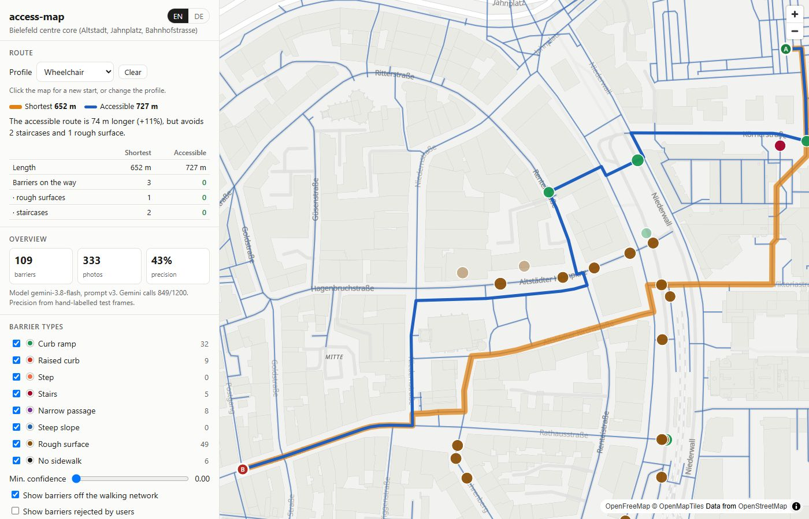
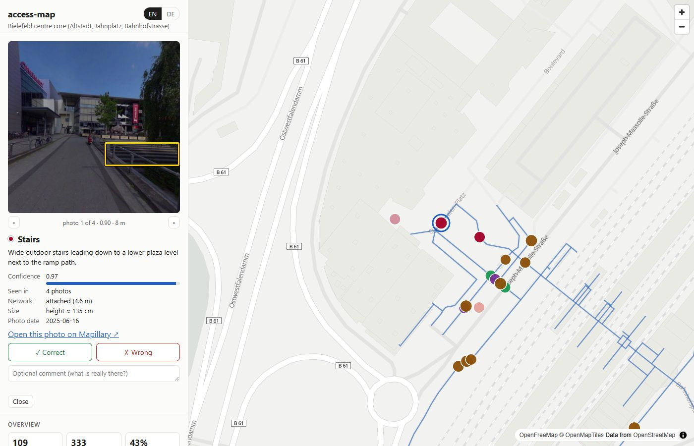

# access-map

**An accessibility map and router for people on wheels.** access-map finds barriers such as
stairs, high curbs and cobblestones in open street-level photos (Mapillary) using Google's
Gemini vision model. It places them on the OpenStreetMap walking network and computes
routes for a mobility profile (wheelchair, stroller, rolling suitcase), side by side with
the plain shortest route.

**Live demo:** https://access-map-eight.vercel.app/ (pilot area: Bielefeld city centre, about 0.9 km²)



On the map you can:
- **Browse barriers:** filter by type and confidence, and open any barrier to see the
  photo it was found in, with the model's bounding box.
- **Compare routes:** pick a profile, click a start and a destination, and get *"The
  accessible route is 74 m longer (+11%), but avoids 2 staircases and 1 rough surface."*
- **Give feedback:** mark a barrier ✓ Correct or ✗ Wrong. Rejected barriers stop
  affecting routes immediately.
- **Switch language:** the interface and the barrier descriptions are available in
  English and German.
- **Check the numbers:** a statistics page shows barriers per type, how many are attached
  to the walking network, and how often the model is right for each type.



## How it works

```
OpenStreetMap ──► walking graph + OSM kerbs, steps, wheelchair tags ──────────────┐
                                                                                  ▼
Mapillary ──► frame selection ──► Gemini (structured JSON) ──► geolocate ──► routing graph
              (fresh, on-network,  boxes + type + distance      + cluster       │
               panoramas cropped)  + EN/DE description           + snap          ▼
                                                              FastAPI app / static site
                                                              (routing runs in the browser)
```

1. **OSM:** the walking network for the area is downloaded, and its accessibility tags
   (`highway=steps`, `kerb=*`, `surface`, `wheelchair=no`) are kept.
2. **Imagery:** recent Mapillary images near the walking network are selected and
   spread evenly over the streets. Frames shot from motorways, images with unreliable
   positions and badly oriented panoramas are dropped; panoramas are cut into four
   90° views.
3. **Detection:** Gemini returns barriers as validated JSON: type, box, confidence,
   estimated distance and size, and a short English and German description. Every
   answer is cached on disk together with a fingerprint of its inputs, so reruns cost
   no API calls.
4. **Geolocation:** each box is turned into a map point using the camera position,
   heading, field of view and the estimated distance. Repeated sightings are merged
   (DBSCAN), and the barriers are attached to the walking network: curbs to nodes or
   crossings, everything else to the nearest edge.
5. **Routing:** edge cost = length × surface factor + barrier penalties. Some barriers
   block a profile outright; the stairs block wheelchairs, for example. Every request
   returns the shortest and the accessible route, and warns when the detour exceeds
   +50% or no barrier-free path exists. The router exists twice, in Python and as a
   line-by-line JavaScript port, and a test keeps the two identical. That lets the
   public site stay fully static.
6. **Evaluation:** OSM has too little ground truth for curbs, so 60 frames were
   hand-labelled; 18 of them were held out until the final prompt was chosen.

## Results (Bielefeld pilot)

| | |
|---|---|
| Frames analysed | 333 (300 Mapillary images, incl. 11 panoramas) |
| Barriers on the map | 109 (78 attached to the walking network) |
| Detection precision / recall (hold-out, frame level) | 0.43 / 0.75 |
| Prompt tuning | v1 → v3: false alarms on the tuning frames cut from 35 to 12 |
| Gemini calls used | 849 (≈ $0.0025 per frame on the paid tier) |
| Routing demo | accessible route differs from the shortest in 25 of 30 test routes; < 70 ms per request |

Details, the errors that remain and their examples are in [REPORT.md](REPORT.md).

## Running it

### Requirements
- Python 3.11–3.13 and [uv](https://docs.astral.sh/uv/). Plain `pip` also works with `pyproject.toml`.
- Node.js, only for the Vercel deploy and one optional test.
- API keys, to build your own data:
  - **Gemini:** in [Google AI Studio](https://aistudio.google.com) choose *Get API key* →
    *Create API key*. The free tier is enough for a small area.
  - **Mapillary:** at mapillary.com open the developer dashboard → *Register application*
    and copy the **Client Token** (it starts with `MLY|`).

```bash
git clone https://github.com/r671h/access-map.git
cd access-map
uv sync --extra dev          # or: make setup
cp .env.example .env         # then fill in GEMINI_API_KEY and MAPILLARY_TOKEN
uv run accessmap check       # verifies both keys and the Overpass API
```

### Try it without keys

```bash
uv run accessmap demo        # or: make demo  →  http://127.0.0.1:8000
```

The demo serves a ~500 m excerpt of the Bielefeld results bundled in `tests/fixtures/demo/`:
43 barriers, their 51 photos, and a routing graph. It needs no keys and no pipeline run.
The server makes no network calls; the browser still loads MapLibre and the base map online.
Feedback given in the demo lives in a temporary folder that is removed when you stop it.

> The full data (photos, Gemini answers, OSM graph) is not in the repository. To map the
> whole area, or your own, run the pipeline below once.

### Pipeline

Every step is its own command, and every step is idempotent: reruns skip work that is
already done. On Linux/macOS/WSL, `make <step>` does the same as `uv run accessmap <step>`,
and `make pipeline` runs fetch-osm → fetch-images → analyze → geolocate → evaluate → build-graph.

| Command | What it does |
|---|---|
| `accessmap coverage` | imagery and OSM coverage report for the configured area |
| `accessmap fetch-osm` | walking graph, kerbs, steps, barriers |
| `accessmap fetch-images` | selects, downloads and crops Mapillary frames |
| `accessmap analyze --all` | runs Gemini on every frame (cached; respects the call budget) |
| `accessmap geolocate` | places, clusters and snaps detections → `barriers.geojson` |
| `accessmap evaluate` | metrics against the hand labels and OSM |
| `accessmap build-graph` | walking graph + barriers → `routing_graph.json` |
| `accessmap route-demo` | 10 random pairs × every profile → `reports/routing_demo.md` |
| `accessmap export-osm` | suggested OSM tags for mappers → `data/processed/osm_suggestions.geojson` |
| `accessmap serve` | web app on http://127.0.0.1:8000 (statistics at `/stats.html`) |
| `accessmap export-site` | static site for Vercel → `site/` |
| `accessmap demo` | offline demo on `tests/fixtures/demo/` |
| `accessmap build-demo` | (maintainers) cut a new demo excerpt from the pipeline results |

Useful options: `analyze --prompt v3`, `analyze --retry-failed`, `evaluate --final`,
`serve --host 0.0.0.0 --port 8000`. Only a full run (`analyze --all`) of the configured model
and prompt writes the live `detections.jsonl`; test runs (`--limit`, `--subset tuning`, other
models or prompts) go to `data/processed/runs/`.

### Suggesting fixes to OpenStreetMap
access-map never edits OpenStreetMap. `accessmap export-osm` writes the barriers worth a
mapper's look to `data/processed/osm_suggestions.geojson`. That means barriers that are
permanent, have confidence ≥ 0.8, were seen in at least 2 photos, have a clear OSM tag
(`kerb=lowered`, `kerb=raised`, `highway=steps`), and are not mapped yet: no kerb node
within 10 m, no steps within 20 m. For Bielefeld that is 5 lowered curbs.

Each feature carries the suggested tags, an instruction and a Mapillary link. To use it:
1. Open each point together with its Mapillary photo and check that the barrier is really
   there. Detections are automatic and can be wrong.
2. Map it by hand in iD or JOSM, citing Mapillary as the source.
3. For more than a handful, create a [MapRoulette](https://maproulette.org) challenge and
   upload the file as its GeoJSON source (one task per feature). Follow the OSM
   [Automated Edits code of conduct](https://wiki.openstreetmap.org/wiki/Automated_Edits_code_of_conduct):
   every change is checked and made by a person.

### Configuration
- `config/project.yaml`: the area (bbox), budget (`max_images`, `max_gemini_calls`), Gemini
  model and prompt version, barrier types, snapping distances, maximum detour, and UI
  languages. To map a different neighbourhood, change `area.bbox`, check
  `accessmap coverage` and rerun the pipeline.
- `config/profiles.yaml`: per-profile blocked barriers, penalties in metres and surface
  multipliers.
- `src/accessmap/vision/prompts/`: prompt versions. The version is part of the cache key,
  so a new prompt never reuses the old answers.
- Local vision model (experimental): `analyze --model ollama:<tag>` runs the same prompt and
  schema on a model served by [Ollama](https://ollama.com), without API costs (settings under
  `local:` in `project.yaml`). Tested with Qwen3-VL 8B on an 8 GB GPU (about 20 s per frame).
  It produced far more false alarms than Gemini and constant confidence scores, so the
  published results use Gemini.

### Deploying to Vercel
```bash
uv run accessmap export-site      # site/: page, JSON data, resized photos, feedback function
npx vercel deploy site --prod
```
The repository itself holds no built site, so the root `vercel.json` turns off deploys on
`git push`; if the Vercel project is connected to GitHub, a push would otherwise replace the
live site with an empty one. Deploy with the two commands above.

Feedback on the public site needs a Postgres database: in the Vercel project open
**Storage → Create Database → Neon**, connect it to the project, and deploy again. Without
a database the site still works; it just hides the feedback buttons.

### Tests
```bash
uv run pytest        # offline: Gemini, Mapillary and the database are mocked or faked
uv run ruff check src tests
```

## Project layout
```
config/            project.yaml (area, budget, model...), profiles.yaml (routing profiles)
labels/            hand labels of 60 frames + train/hold-out split
src/accessmap/
  osm/             walking network and OSM layers (Overpass, osmnx)
  imagery/         Mapillary search, frame selection, panorama cropping
  vision/          Gemini client (cache, budget ledger, retries), prompts, response schema
  geo/             detection → coordinate, clustering, snapping to the network
  eval/            metrics, labels, contact sheets
  routing/         routing graph, Python router, demo
  web/             FastAPI app, static frontend (map + stats page, router.js), Vercel export
  demo.py          offline demo: build and serve the bundled excerpt
tests/             offline tests (pytest; one Node test for the Vercel function)
  fixtures/demo/   demo excerpt: barriers, photos, network, routing graph
```

## Limitations
- **Imperfect detection:** about 4 in 10 reported barriers are real on held-out frames.
  Common mistakes are cobbled parking lanes read as rough sidewalks, and curb ramps on
  traffic islands. The feedback buttons exist to correct this over time.
- **Dashcam imagery:** most imagery is dashcam footage from cars, so curbs at crossings
  are often too far away or too small to judge.
- **Snapshot in time:** the photos are up to 6 years old; construction sites and parked
  cars are deliberately ignored.
- **Lifts:** elevators are not modelled yet, so stations with lifts can look inaccessible.
- **Curbs:** a curb blocks the whole street segment it is mapped on, not just the crossing.

## Data and attribution
- Map data © [OpenStreetMap](https://www.openstreetmap.org/copyright) contributors (ODbL);
  base map tiles by [OpenFreeMap](https://openfreemap.org) / OpenMapTiles.
- Street-level photos © [Mapillary](https://www.mapillary.com) contributors (CC BY-SA 4.0),
  shown resized with their detection boxes; the demo bundles 51 of them, downscaled
  (`tests/fixtures/demo/photos/ATTRIBUTION.md`).
- Barrier detection by Google Gemini (`gemini-3.8-flash`).
- Code: [MIT](LICENSE). The data keeps its own licences above (ODbL for OSM, CC BY-SA 4.0 for the photos).
